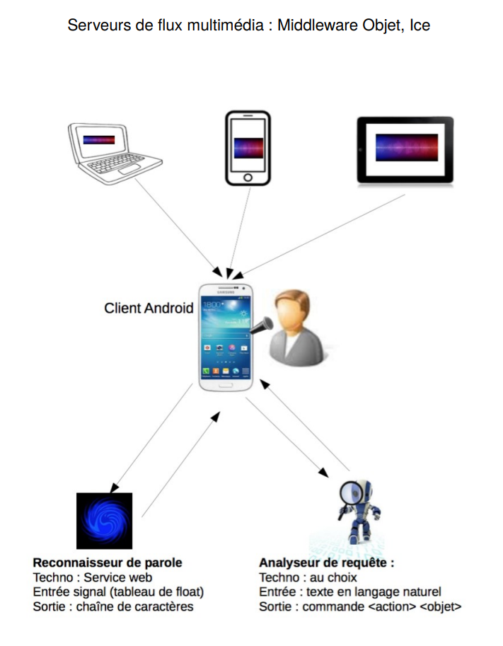

# Application Architectures distribuées
Il s'agit de développer de la manière la plus autonome possible une
application distribuée qui utilise différentes technologies vues dans l'UCE, en
particulier Ice et les services Web. L'application doit permettre de piloter par
la parole un lecteur de flux audio-vidéo développé sous Android.

L'application devra donner accès à toutes les fonctionnalités du lecteur par
des message vocaux formulés en langage naturel (sans contrainte sur la
forme des messages). Par exemple, l'application devrait pouvoir lancer la
lecture du morceau ''Hotel California'' à partir d'une requête du type ''je veux
écouter Hotel California''. Cette commande vocale doit reposer sur :

    – l'acquisition du signal : il faut capter le signal reçu par le micro du terminal et le numériser. Il existe de nombreux outils, en Java par exemple, qui permettent d'implémenter assez simplement cette opération de captation/numérisation. Cette partie devra évidemment être intégrée au client.

    – la transcription automatique du message : on utilisera une librairie de reconnaissance de la parole développée au LIA: il s'agit d'un composant encapsulé dans un serveur Ice, qui réalise la transcription automatique d'un message oral. Ce serveur Ice est disponible sur la plate-forme E-uapv. La fonctionnalité la plus importante est celle qui prend le signal (sous forme d'un tableau de nombre réels) et qui renvoie une chaîne de caractères (la transcription textuelle, telle que le système l'a extraite du signal acoustique).

    – un analyseur de requêtes : la requête étant formulée en langage naturel , il faudra l'analyser pour déduire l'intention de l'utilisateur. Par exemple, si on trouve un titre de chanson connu du système avec le mot « écouter », on peut en déduire qu'il faut jouer le morceau en question. On développera un analyseur simple qui réalise cette opération d'analyse de la requête. Cet analyseur devra être implémenté dans un service distant qui recherche dans un message brut, un couple <action, objet>. Les listes d'actions (par exemple « jouer », « stopper », « supprimer ») et d'objets (les morceaux de musique) seront supposées connues a priori. 
    
    – un serveur de flux audio-vidéo en streaming : on 
    utilisera l'application qui a été développée lors du TP de Middleware, en Ice. 
    
L'ensemble de l'application devra mettre en œuvre au moins 2 des 3 technologies vues en cours (Middleware, service Web, JMS).
Serveurs de flux multimédia : Middleware Objet, Ice



# Compléments 

https://huggingface.co/Word2vec/fauconnier_frWac_non_lem_no_postag_no_phrase_200_skip_cut100/tree/main
Lien vers le téléchargement du model à placer dans le dossier tal/models

```bash
pip install -r requirements.txt
```

# Comment utiliser AsrCli

Créer un fichier config.yaml comme suit dans `./asr` :
```yaml
#   ./asr/config.yaml
api_key: "votre_clé_openai"
```

# lancement des serveurs
## creation virtual env

```bash
python -m venv .venv
```

## activation virtual env

```bash
.\.venv\Scripts\activate
```

## lancement

```bash
flask --app tal/Flask.py run --port 6000
python stream/index.py 15000 all

python tal/Flask.py
```